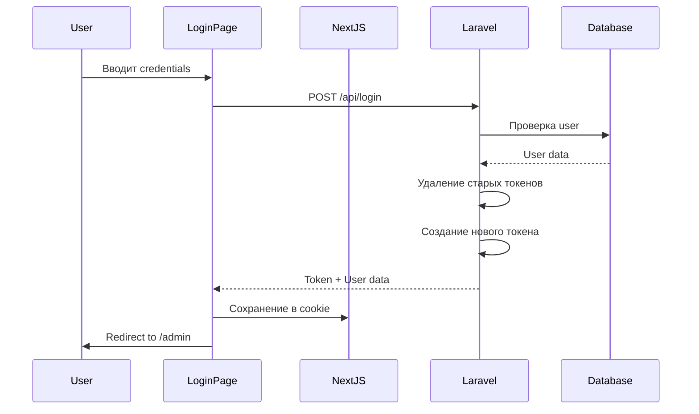
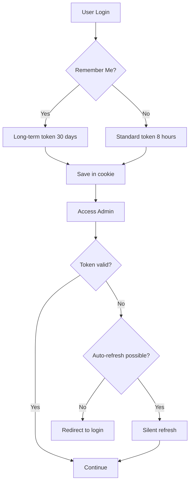

# Design Document

## Overview

Данный документ описывает архитектурное решение для улучшения системы авторизации и производительности админ-панели. Проект использует Laravel 12.x с Laravel Sanctum для аутентификации на backend и Next.js 15.3.3 (App Router) на frontend.

### Current Architecture Analysis

**Backend (Laravel):**
- Аутентификация: Laravel Sanctum (token-based)
- Guard: `sanctum` для API, `web` для session-based
- Session driver: `database`
- Current session lifetime: 120 минут (2 часа)
- Session expire_on_close: `false`
- AuthController: `/api/login`, `/api/logout`, `/api/me`

**Frontend (Next.js):**
- Хранение токена: Cookie `admin-token`
- Middleware: проверка токена для всех `/admin/*` маршрутов (кроме `/admin/login`)
- Текущий TTL токена в cookie: 7 дней
- Sidebar: всегда отображается в admin layout
- Login page: использует форму без правильных autocomplete атрибутов

### Key Issues Identified

1. **Sidebar visibility**: Меню отображается даже на странице логина
2. **Password manager integration**: Отсутствуют правильные autocomplete атрибуты
3. **Session lifetime**: 120 минут может быть недостаточно для длительной работы
4. **No "Remember Me"**: Отсутствует функция запоминания пользователя
5. **No password change**: Нет функционала смены пароля
6. **Token refresh**: Отсутствует автоматическое обновление токенов
7. **Performance**: Нет lazy loading для админских компонентов

## Architecture

### Authentication Flow



### Session Management Flow



## Components and Interfaces

### 1. Backend Components

#### 1.1 AuthController Enhancement

**New Endpoint: Change Password**
```php
POST /api/admin/change-password
Request: {
  current_password: string,
  new_password: string,
  new_password_confirmation: string
}
Response: {
  success: boolean,
  message: string
}
```

**Enhanced Login Endpoint**
```php
POST /api/login
Request: {
  email: string,
  password: string,
  remember: boolean  // NEW
}
Response: {
  success: boolean,
  token: string,
  user: {
    id: number,
    name: string,
    email: string
  },
  expires_at: string  // NEW
}
```

#### 1.2 Middleware Enhancement

**Token Refresh Middleware**
- Проверка времени истечения токена
- Автоматическое обновление токена за 30 минут до истечения
- Возврат нового токена в response header `X-New-Token`

#### 1.3 Configuration Changes

**config/session.php:**
```php
'lifetime' => env('SESSION_LIFETIME', 480), // 8 hours
'expire_on_close' => false,
```

**config/sanctum.php:**
```php
'expiration' => env('SANCTUM_TOKEN_EXPIRATION', 480), // 8 hours default
'remember_expiration' => env('SANCTUM_REMEMBER_EXPIRATION', 43200), // 30 days
```

### 2. Frontend Components

#### 2.1 Login Page Enhancement

**File:** `frontend_next/src/app/admin/login/page.tsx`

**Changes:**
- Добавить атрибуты autocomplete для полей
- Добавить чекбокс "Запомнить меня"
- Обновить логику сохранения токена с учётом remember
- Использовать `<form>` с правильными атрибутами

**New Interface:**
```typescript
interface LoginFormData {
  username: string;
  password: string;
  remember: boolean;
}

interface LoginResponse {
  success: boolean;
  token: string;
  user: {
    id: number;
    name: string;
    email: string;
  };
  expires_at: string;
}
```

#### 2.2 Admin Layout Enhancement

**File:** `frontend_next/src/app/admin/layout.tsx`

**Changes:**
- Условное отображение Sidebar (скрыть на `/admin/login`)
- Проверка pathname перед рендером sidebar

**Logic:**
```typescript
const pathname = usePathname();
const showSidebar = pathname !== '/admin/login';

return (
  <SidebarProvider>
    {showSidebar && <AppSidebar />}
    <main className={showSidebar ? "flex-1" : "w-full"}>
      {/* content */}
    </main>
  </SidebarProvider>
);
```

#### 2.3 Password Change Component

**New File:** `frontend_next/src/app/admin/settings/change-password/page.tsx`

**Interface:**
```typescript
interface ChangePasswordFormData {
  currentPassword: string;
  newPassword: string;
  confirmPassword: string;
}

interface ChangePasswordResponse {
  success: boolean;
  message: string;
}
```

**Features:**
- Форма с тремя полями
- Валидация на клиенте (минимум 8 символов, совпадение паролей)
- Валидация на сервере
- Автоматическое скрытие сообщения через 3 секунды
- Disabled кнопка во время отправки

#### 2.4 Sidebar Enhancement

**File:** `frontend_next/src/components/app-sidebar.tsx`

**Changes:**
- Добавить пункт меню "Настройки" → "Сменить пароль"

```typescript
const settingsItems = [
  {
    title: "Сменить пароль",
    url: "/admin/settings/change-password",
    icon: Key,
  },
];
```

#### 2.5 Token Refresh Hook

**New File:** `frontend_next/src/hooks/useTokenRefresh.ts`

**Purpose:** Автоматическое обновление токена перед истечением

```typescript
interface TokenRefreshHook {
  refreshToken: () => Promise<void>;
  isRefreshing: boolean;
}

export function useTokenRefresh(): TokenRefreshHook {
  // Проверка токена каждые 5 минут
  // Обновление за 30 минут до истечения
  // Обработка ошибок с редиректом на login
}
```

#### 2.6 API Client Enhancement

**File:** `frontend_next/src/lib/api.ts` (or create if not exists)

**Features:**
- Централизованный API client с axios/fetch
- Автоматическое добавление токена в headers
- Перехват 401/403 ошибок
- Обработка X-New-Token header для silent refresh
- Правильная передача credentials

```typescript
const apiClient = axios.create({
  baseURL: process.env.NEXT_PUBLIC_API_URL,
  withCredentials: true,
  headers: {
    'Content-Type': 'application/json',
    'Accept': 'application/json',
  }
});

// Request interceptor
apiClient.interceptors.request.use((config) => {
  const token = getTokenFromCookie();
  if (token) {
    config.headers.Authorization = `Bearer ${token}`;
  }
  return config;
});

// Response interceptor
apiClient.interceptors.response.use(
  (response) => {
    // Check for new token in header
    const newToken = response.headers['x-new-token'];
    if (newToken) {
      saveTokenToCookie(newToken);
    }
    return response;
  },
  (error) => {
    if (error.response?.status === 401) {
      // Redirect to login
      window.location.href = '/admin/login';
    }
    return Promise.reject(error);
  }
);
```

## Data Models

### User Model (Laravel)

**Existing fields:**
```php
- id: bigint
- name: string
- email: string
- password: string (hashed)
- created_at: timestamp
- updated_at: timestamp
```

**No changes needed** - модель уже поддерживает все необходимые поля.

### Token Storage (Laravel Sanctum)

**Table: personal_access_tokens**
```php
- id: bigint
- tokenable_type: string
- tokenable_id: bigint
- name: string
- token: string (hashed)
- abilities: text
- expires_at: timestamp (NEW - if not exists)
- last_used_at: timestamp
- created_at: timestamp
- updated_at: timestamp
```

### Session Storage (Laravel)

**Table: sessions**
```php
- id: string
- user_id: bigint (nullable)
- ip_address: string
- user_agent: text
- payload: text
- last_activity: integer
```

**No changes needed** - таблица уже существует.

## Error Handling

### Backend Error Responses

**Validation Errors (422):**
```json
{
  "message": "The given data was invalid.",
  "errors": {
    "current_password": ["Текущий пароль неверен"],
    "new_password": ["Пароль должен содержать минимум 8 символов"]
  }
}
```

**Authentication Errors (401):**
```json
{
  "message": "Unauthenticated."
}
```

**Authorization Errors (403):**
```json
{
  "message": "This action is unauthorized."
}
```

### Frontend Error Handling

**Strategy:**
1. Try-catch блоки для всех async операций
2. Специфичные сообщения для каждого типа ошибки
3. Автоматическое скрытие через 3 секунды
4. Disabled состояние кнопок во время загрузки
5. Редирект на login при 401

**Error Display Component:**
```typescript
interface ErrorAlertProps {
  error: string | null;
  onDismiss: () => void;
}

// Auto-dismiss after 3 seconds
useEffect(() => {
  if (error) {
    const timer = setTimeout(() => onDismiss(), 3000);
    return () => clearTimeout(timer);
  }
}, [error]);
```

## Testing Strategy

### Backend Testing

**Unit Tests:**
1. AuthController::changePassword
   - Валидация текущего пароля
   - Валидация нового пароля
   - Успешная смена пароля
   - Хэширование нового пароля

2. Token Refresh Middleware
   - Проверка истечения токена
   - Генерация нового токена
   - Возврат токена в header

**Integration Tests:**
1. Login flow с remember me
2. Password change flow
3. Token refresh flow
4. Logout и удаление токенов

### Frontend Testing

**Component Tests:**
1. Login page
   - Рендер формы с правильными атрибутами
   - Валидация полей
   - Отправка формы
   - Обработка ошибок
   - Remember me checkbox

2. Password change page
   - Рендер формы
   - Валидация паролей
   - Успешная смена
   - Обработка ошибок

3. Sidebar visibility
   - Скрыт на /admin/login
   - Виден на других admin страницах

**E2E Tests:**
1. Полный flow авторизации
2. Смена пароля и повторный вход
3. Remember me функциональность
4. Token refresh
5. Logout

### Manual Testing Checklist

- [ ] Страница логина открывается без меню
- [ ] Браузер предлагает сохранить пароль
- [ ] Вход работает с правильными credentials
- [ ] После входа меню появляется
- [ ] Remember me сохраняет сессию на 30 дней
- [ ] Сессия не истекает преждевременно (8 часов)
- [ ] Смена пароля работает корректно
- [ ] Повторный вход с новым паролем работает
- [ ] Token автоматически обновляется
- [ ] 401 ошибка перенаправляет на login
- [ ] Нет регрессии в существующем функционале
- [ ] Скорость загрузки не ухудшилась

## Performance Optimization

### 1. Code Splitting

**Strategy:** Использовать dynamic imports для тяжёлых компонентов админки

**Implementation:**
```typescript
// Instead of:
import HeavyComponent from './HeavyComponent';

// Use:
const HeavyComponent = dynamic(() => import('./HeavyComponent'), {
  loading: () => <Skeleton />,
  ssr: false
});
```

**Target Components:**
- Rich text editors
- Chart libraries
- Image upload components
- Complex form components

### 2. Lazy Loading Routes

**Next.js App Router** уже поддерживает автоматическое code splitting по маршрутам.

**Additional optimization:**
```typescript
// app/admin/[feature]/page.tsx
export const dynamic = 'force-dynamic'; // Только где необходимо
```

### 3. API Response Caching

**Strategy:** Кэширование статических данных (категории, настройки)

**Implementation:**
```typescript
// SWR or React Query for client-side caching
const { data, error } = useSWR('/api/categories', fetcher, {
  revalidateOnFocus: false,
  revalidateOnReconnect: false,
  refreshInterval: 300000, // 5 minutes
});
```

### 4. Image Optimization

**Already implemented:** Next.js Image component

**Verification:**
- Все изображения используют `next/image`
- Правильные размеры и форматы
- Lazy loading для изображений вне viewport

### 5. Bundle Size Optimization

**Analysis:**
```bash
npm run build
# Analyze bundle size
```

**Actions:**
- Удалить неиспользуемые зависимости
- Tree-shaking для библиотек
- Использовать named imports

### 6. Laravel Performance

**Compression Middleware:**
```php
// app/Http/Kernel.php
protected $middleware = [
    // ...
    \Illuminate\Http\Middleware\HandleCors::class,
    \App\Http\Middleware\CompressResponse::class, // NEW
];
```

**Browser Caching:**
```php
// public/.htaccess or nginx config
# Cache static assets for 1 year
<FilesMatch "\.(jpg|jpeg|png|gif|svg|css|js|woff|woff2)$">
    Header set Cache-Control "max-age=31536000, public"
</FilesMatch>
```

### 7. Database Query Optimization

**Existing queries review:**
- Добавить индексы где необходимо
- Использовать eager loading для relationships
- Избегать N+1 queries

### 8. Production Build

**Verification:**
```bash
# Next.js
NODE_ENV=production npm run build

# Laravel
php artisan config:cache
php artisan route:cache
php artisan view:cache
```

## Security Considerations

### 1. Token Security

- Токены хранятся в httpOnly cookies (где возможно)
- CSRF protection для session-based requests
- Secure flag для cookies в production
- SameSite=Lax для защиты от CSRF

### 2. Password Security

- Минимум 8 символов
- Хэширование с bcrypt (Laravel default)
- Валидация текущего пароля при смене
- Rate limiting для login и password change endpoints

### 3. CORS Configuration

**config/cors.php:**
```php
'paths' => ['api/*'],
'allowed_origins' => [env('FRONTEND_URL')],
'allowed_methods' => ['*'],
'allowed_headers' => ['*'],
'exposed_headers' => ['X-New-Token'],
'max_age' => 0,
'supports_credentials' => true,
```

### 4. Rate Limiting

**routes/api.php:**
```php
Route::middleware(['throttle:5,1'])->group(function () {
    Route::post('/login', [AuthController::class, 'login']);
    Route::post('/admin/change-password', [AuthController::class, 'changePassword']);
});
```

## Migration Strategy

### Phase 1: Backend Changes (Low Risk)

1. Добавить endpoint для смены пароля
2. Обновить login endpoint для поддержки remember me
3. Обновить конфигурацию session lifetime
4. Добавить token refresh middleware
5. Тестирование backend изменений

### Phase 2: Frontend Changes (Medium Risk)

1. Обновить login page (autocomplete, remember me)
2. Условное отображение sidebar
3. Создать страницу смены пароля
4. Добавить пункт меню для смены пароля
5. Тестирование frontend изменений

### Phase 3: Integration (Medium Risk)

1. Интегрировать token refresh hook
2. Обновить API client с interceptors
3. Тестирование полного flow
4. E2E тестирование

### Phase 4: Performance Optimization (Low Risk)

1. Добавить dynamic imports
2. Настроить caching
3. Оптимизировать bundle size
4. Добавить compression
5. Измерение производительности

### Rollback Plan

**Если возникнут проблемы:**
1. Backend: откатить миграции и код через Git
2. Frontend: откатить изменения через Git
3. Конфигурация: восстановить старые значения в .env
4. Очистить кэш: `php artisan cache:clear`, `npm run build`

## Implementation Notes

### Critical Constraints

1. **НЕ ломать существующий функционал**
   - Все существующие API endpoints должны работать
   - Обратная совместимость с текущими токенами
   - Существующие пользователи могут войти без проблем

2. **НЕ изменять дизайн**
   - Использовать существующие UI компоненты
   - Сохранить стили и layout
   - Только функциональные изменения

3. **НЕ ухудшать производительность**
   - Измерять до и после оптимизации
   - Lazy loading не должен увеличивать initial load
   - Кэширование не должно показывать устаревшие данные

4. **Тестировать каждое изменение**
   - Поэтапное внедрение
   - Проверка после каждого шага
   - Откат при проблемах

### Development Environment

**Required:**
- PHP 8.2+
- Composer
- Node.js 18+
- PostgreSQL
- Laravel 12.x
- Next.js 15.3.3

**Testing:**
- PHPUnit для backend
- Vitest/Jest для frontend unit tests
- Playwright для E2E tests

## Conclusion

Данное проектное решение обеспечивает:
- Улучшенный UX авторизации с поддержкой браузерных менеджеров паролей
- Стабильную работу сессий с увеличенным временем жизни
- Функционал смены пароля для администраторов
- Автоматическое обновление токенов для бесшовной работы
- Оптимизированную производительность админ-панели
- Сохранение всего существующего функционала без регрессий

Все изменения спроектированы с учётом минимального риска и максимальной обратной совместимости.
