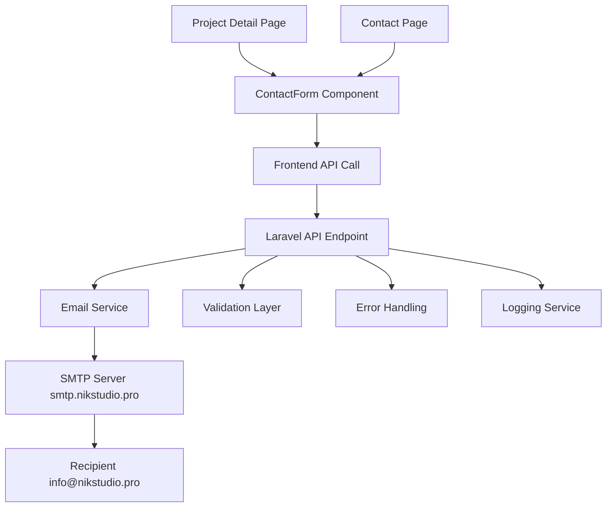

# Design Document

## Overview

The contact form email system will integrate SMTP email functionality into the existing NIK Studio website. The system consists of three main components: frontend form handling, backend API endpoints, and email service integration. The design ensures reliable email delivery while maintaining the existing user experience and form validation patterns.

## Architecture

### System Components



### Data Flow

1. **Form Submission**: User fills out contact form and submits
2. **Client Validation**: Frontend validates required fields and formats
3. **API Request**: Form data sent to Laravel backend via POST request
4. **Server Validation**: Backend validates data and sanitizes input
5. **Email Composition**: System creates formatted email with form data
6. **SMTP Delivery**: Email sent via configured SMTP server
7. **Response Handling**: Success/error response returned to frontend
8. **User Feedback**: Appropriate message displayed to user

## Components and Interfaces

### Frontend Components

#### ContactForm Component Enhancement
```typescript
interface ContactFormData {
  name: string;
  email: string;
  company: string;
  message: string;
  source?: 'project' | 'contact';
  projectTitle?: string;
}

interface ContactFormProps {
  className?: string;
  source?: 'project' | 'contact';
  projectTitle?: string;
}
```

#### API Service
```typescript
interface EmailApiResponse {
  success: boolean;
  message: string;
  data?: any;
}

class ContactEmailService {
  static async sendContactEmail(data: ContactFormData): Promise<EmailApiResponse>
  static async sendProjectInquiry(data: ContactFormData): Promise<EmailApiResponse>
}
```

### Backend Components

#### API Controller
```php
class ContactController extends Controller
{
    public function sendContactEmail(ContactEmailRequest $request): JsonResponse
    public function sendProjectInquiry(ContactEmailRequest $request): JsonResponse
}
```

#### Email Service
```php
class ContactEmailService
{
    public function sendContactInquiry(array $data): bool
    public function sendProjectInquiry(array $data): bool
    private function formatEmailContent(array $data, string $type): string
}
```

#### Mail Classes
```php
class ContactInquiryMail extends Mailable
class ProjectInquiryMail extends Mailable
```

## Data Models

### Request Validation
```php
class ContactEmailRequest extends FormRequest
{
    public function rules(): array
    {
        return [
            'name' => 'required|string|min:2|max:50',
            'email' => 'required|email|max:255',
            'company' => 'nullable|string|max:100',
            'message' => 'required|string|min:10|max:1000',
            'source' => 'required|in:project,contact',
            'project_title' => 'nullable|string|max:255'
        ];
    }
}
```

### Email Templates
```php
// Contact Inquiry Email Structure
[
    'subject' => 'Новый запрос на сотрудничество',
    'from' => 'hello@nikstudio.pro',
    'to' => 'info@nikstudio.pro',
    'data' => [
        'name' => string,
        'email' => string,
        'company' => string|null,
        'message' => string,
        'timestamp' => Carbon,
        'source' => 'contact'
    ]
]

// Project Inquiry Email Structure
[
    'subject' => 'Новый запрос по проекту - {project_title}',
    'from' => 'hello@nikstudio.pro',
    'to' => 'info@nikstudio.pro',
    'data' => [
        'name' => string,
        'email' => string,
        'company' => string|null,
        'message' => string,
        'project_title' => string,
        'timestamp' => Carbon,
        'source' => 'project'
    ]
]
```

## Error Handling

### Frontend Error States
```typescript
type SubmitStatus = 'idle' | 'submitting' | 'success' | 'error';

interface ErrorMessages {
  validation: string;
  network: string;
  smtp: string;
  server: string;
  generic: string;
}

const ERROR_MESSAGES: ErrorMessages = {
  validation: 'Пожалуйста, исправьте ошибки в форме',
  network: 'Проверьте подключение к интернету и попробуйте снова',
  smtp: 'Ошибка подключения к почтовому серверу',
  server: 'Сервис временно недоступен, попробуйте позже',
  generic: 'Произошла ошибка при отправке сообщения'
};
```

### Backend Error Handling
```php
class ContactEmailException extends Exception
{
    public static function smtpConnectionFailed(): self
    public static function emailDeliveryFailed(): self
    public static function invalidRecipient(): self
}

// Error Response Format
[
    'success' => false,
    'message' => 'User-friendly error message',
    'errors' => [
        'field_name' => ['Specific validation error']
    ],
    'error_code' => 'SMTP_CONNECTION_FAILED'
]
```

### Error Logging Strategy
- **SMTP Errors**: Log with full stack trace and connection details
- **Validation Errors**: Log user input (sanitized) and validation failures
- **Network Errors**: Log timeout and connection issues
- **Email Content**: Log email composition and sending attempts

## Testing Strategy

### Frontend Testing
```typescript
// Unit Tests
describe('ContactForm', () => {
  test('validates required fields before submission')
  test('displays loading state during submission')
  test('shows success message after successful send')
  test('handles network errors gracefully')
  test('clears form after successful submission')
})

// Integration Tests
describe('Email API Integration', () => {
  test('sends contact form data to correct endpoint')
  test('handles API error responses')
  test('retries failed requests appropriately')
})
```

### Backend Testing
```php
// Feature Tests
class ContactEmailTest extends TestCase
{
    public function test_sends_contact_inquiry_email()
    public function test_validates_required_fields()
    public function test_handles_smtp_connection_failure()
    public function test_formats_email_content_correctly()
    public function test_logs_email_sending_attempts()
}

// Unit Tests
class ContactEmailServiceTest extends TestCase
{
    public function test_formats_contact_email_template()
    public function test_formats_project_email_template()
    public function test_handles_missing_project_title()
}
```

### SMTP Configuration Testing
```php
// Mail Configuration Test
class SmtpConfigurationTest extends TestCase
{
    public function test_smtp_connection_with_credentials()
    public function test_email_delivery_to_recipient()
    public function test_sender_authentication()
    public function test_ssl_tls_connection_security()
}
```

## Configuration Requirements

### Environment Variables
```env
# SMTP Configuration
MAIL_MAILER=smtp
MAIL_HOST=smtp.nikstudio.pro
MAIL_PORT=587
MAIL_USERNAME=hello@nikstudio.pro
MAIL_PASSWORD=mGKjSqDClU
MAIL_ENCRYPTION=tls
MAIL_FROM_ADDRESS=hello@nikstudio.pro
MAIL_FROM_NAME="NIK Studio"

# Email Recipients
CONTACT_EMAIL_RECIPIENT=info@nikstudio.pro
```

### Laravel Mail Configuration
```php
// config/mail.php updates
'mailers' => [
    'smtp' => [
        'transport' => 'smtp',
        'host' => env('MAIL_HOST', 'smtp.nikstudio.pro'),
        'port' => env('MAIL_PORT', 587),
        'encryption' => env('MAIL_ENCRYPTION', 'tls'),
        'username' => env('MAIL_USERNAME'),
        'password' => env('MAIL_PASSWORD'),
        'timeout' => null,
        'local_domain' => env('MAIL_EHLO_DOMAIN'),
    ],
],

'from' => [
    'address' => env('MAIL_FROM_ADDRESS', 'hello@nikstudio.pro'),
    'name' => env('MAIL_FROM_NAME', 'NIK Studio'),
],
```

## Security Considerations

### Input Sanitization
- Validate and sanitize all form inputs
- Prevent email header injection attacks
- Limit message length and content
- Validate email addresses using Laravel's email validation

### SMTP Security
- Use TLS encryption for SMTP connection
- Store credentials securely in environment variables
- Implement connection timeout limits
- Log authentication failures for monitoring

### Rate Limiting
- Implement rate limiting on email endpoints
- Prevent spam submissions from same IP
- Add CAPTCHA if abuse detected
- Monitor email sending frequency

## Performance Considerations

### Email Queue Implementation
```php
// Queue email sending for better performance
class ContactInquiryJob implements ShouldQueue
{
    public function handle(ContactEmailService $emailService)
    {
        $emailService->sendContactInquiry($this->data);
    }
}
```

### Caching Strategy
- Cache SMTP connection for multiple emails
- Implement connection pooling if needed
- Cache email templates for faster composition

### Monitoring and Alerts
- Monitor email delivery success rates
- Alert on SMTP connection failures
- Track email sending performance metrics
- Log email bounce rates and failures