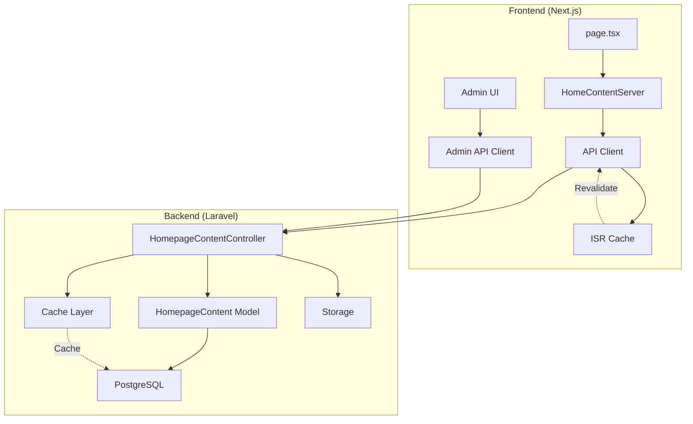
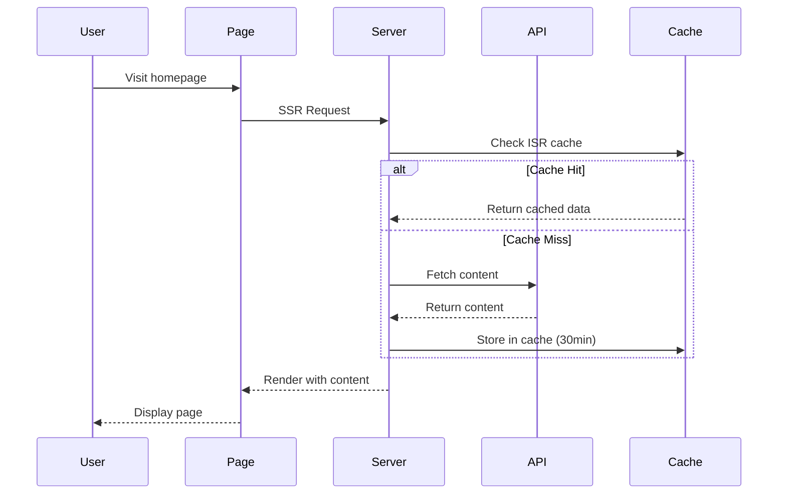

# Design Document

## Overview

Данный дизайн описывает архитектуру системы управления контентом (CMS) для главной страницы. Система позволяет администраторам редактировать весь текстовый контент и изображения через веб-интерфейс, сохраняя при этом текущий дизайн, производительность и SEO-оптимизацию.

### Ключевые принципы дизайна

1. **Сохранение существующего функционала**: Все текущие компоненты, стили и SEO остаются без изменений
2. **Fallback стратегия**: При недоступности API используются hardcoded значения
3. **Производительность**: ISR кеширование с revalidation 30 минут
4. **Безопасность**: Аутентификация для всех изменяющих операций
5. **Гибкость**: Структура данных позволяет легко добавлять новые секции

### Архитектурная диаграмма



## Architecture

### Backend Architecture (Laravel)

#### Database Schema

```sql
CREATE TABLE homepage_content (
    id BIGSERIAL PRIMARY KEY,
    section VARCHAR(100) NOT NULL,           -- hero, main_content, services_1, testimonials_1, etc.
    content_type VARCHAR(20) NOT NULL,       -- 'text' or 'image'
    content_key VARCHAR(100) NOT NULL,       -- hero_title, hero_description, service_1_image, etc.
    content_value TEXT NOT NULL,             -- actual content or image path
    order_index INTEGER DEFAULT 0,           -- for ordering within section
    metadata JSONB,                          -- additional data (alt text, image dimensions, etc.)
    created_at TIMESTAMP,
    updated_at TIMESTAMP,
    
    UNIQUE(section, content_key),
    INDEX idx_section (section),
    INDEX idx_content_type (content_type)
);
```

#### Model Structure

**HomepageContent Model**
- Fillable: section, content_type, content_key, content_value, order_index, metadata
- Casts: metadata → array
- Scopes: bySection($section), byType($type), ordered()
- Methods: isImage(), isText(), getImageUrl()

#### API Endpoints

| Method | Endpoint | Description | Auth Required |
|--------|----------|-------------|---------------|
| GET | `/api/homepage-content` | Get all content grouped by sections | No |
| GET | `/api/homepage-content/{section}` | Get content for specific section | No |
| POST | `/api/homepage-content` | Bulk create/update content | Yes |
| PUT | `/api/homepage-content/{id}` | Update single content item | Yes |
| POST | `/api/homepage-content/upload-image` | Upload and optimize image | Yes |
| DELETE | `/api/homepage-content/{id}` | Delete content item | Yes |


#### Controller Design

**HomepageContentController**

```php
class HomepageContentController extends Controller
{
    // GET /api/homepage-content
    public function index()
    {
        // Returns all content grouped by sections with caching
        $content = Cache::remember('homepage_content_all', 1800, function() {
            return HomepageContent::ordered()->get()->groupBy('section');
        });
        
        return response()->json(['success' => true, 'data' => $content]);
    }
    
    // GET /api/homepage-content/{section}
    public function getBySection($section)
    {
        // Returns content for specific section with caching
        $content = Cache::remember("homepage_content_{$section}", 1800, function() use ($section) {
            return HomepageContent::bySection($section)->ordered()->get();
        });
        
        return response()->json(['success' => true, 'data' => $content]);
    }
    
    // POST /api/homepage-content (bulk update)
    public function bulkUpdate(Request $request)
    {
        // Validates and updates multiple content items
        // Clears cache for affected sections
        // Returns updated content
    }
    
    // PUT /api/homepage-content/{id}
    public function update(Request $request, $id)
    {
        // Updates single content item
        // Clears cache for section
        // Returns updated item
    }
    
    // POST /api/homepage-content/upload-image
    public function uploadImage(Request $request)
    {
        // Validates image (max 2MB, jpg/png/webp)
        // Stores in storage/homepage/
        // Returns normalized path (without /storage/ prefix)
    }
}
```

#### Validation Rules

```php
// For text content
'section' => 'required|string|max:100',
'content_type' => 'required|in:text,image',
'content_key' => 'required|string|max:100',
'content_value' => 'required|string',
'order_index' => 'integer|min:0',
'metadata' => 'nullable|array'

// For image upload
'image' => 'required|image|mimes:jpeg,jpg,png,webp|max:2048'
```


### Frontend Architecture (Next.js)

#### Data Flow



#### Component Structure

**Modified Components:**

1. **HomeContentServer.tsx** (Server Component)
   - Fetches content from API with ISR
   - Passes dynamic content to child components
   - Maintains fallback values

2. **MainContentSection.tsx**
   - Receives content as props
   - Renders dynamic text and images
   - Preserves all CSS classes

3. **ServicesSection.tsx**
   - Receives services array as props
   - Maps over services to render cards
   - Maintains existing layout

4. **TestimonialsSection.tsx**
   - Receives testimonials array as props
   - Renders testimonial cards
   - Preserves carousel functionality

**New Components:**

5. **HomepageEditor** (Admin UI)
   - Tabbed interface by section
   - Form fields for text content
   - Image upload with preview
   - Save/Cancel actions


#### TypeScript Interfaces

```typescript
// Core content interface
interface HomepageContent {
  id: number;
  section: string;
  content_type: 'text' | 'image';
  content_key: string;
  content_value: string;
  order_index: number;
  metadata?: {
    alt_text?: string;
    width?: number;
    height?: number;
    [key: string]: any;
  };
}

// Grouped content by section
interface HomepageContentBySections {
  hero: HomepageContent[];
  main_content: HomepageContent[];
  services_1: HomepageContent[];
  services_2: HomepageContent[];
  // ... other sections
  testimonials_1: HomepageContent[];
  testimonials_6: HomepageContent[];
}

// Helper function to get content value
function getContentValue(
  content: HomepageContent[] | undefined,
  key: string,
  fallback: string
): string {
  const item = content?.find(c => c.content_key === key);
  return item?.content_value || fallback;
}

// Helper function to get image URL
function getImageUrl(
  content: HomepageContent[] | undefined,
  key: string,
  fallback: string
): string {
  const item = content?.find(c => c.content_key === key && c.content_type === 'image');
  if (!item) return fallback;
  
  const path = item.content_value;
  if (path.startsWith('http')) return path;
  if (path.startsWith('/images/')) return path;
  return `${process.env.NEXT_PUBLIC_API_URL}/storage/${path}`;
}
```


#### API Client Functions

```typescript
// Fetch all homepage content
async function getHomepageContent(): Promise<HomepageContentBySections | null> {
  try {
    const apiUrl = process.env.NEXT_PUBLIC_API_URL;
    const response = await fetch(`${apiUrl}/api/homepage-content`, {
      next: { revalidate: 1800 } // ISR: 30 minutes
    });
    
    if (!response.ok) return null;
    
    const data = await response.json();
    return data.success ? data.data : null;
  } catch (error) {
    console.error('Error fetching homepage content:', error);
    return null;
  }
}

// Update content (admin only)
async function updateHomepageContent(
  items: Partial<HomepageContent>[]
): Promise<boolean> {
  try {
    const apiUrl = process.env.NEXT_PUBLIC_API_URL;
    const response = await fetch(`${apiUrl}/api/homepage-content`, {
      method: 'POST',
      headers: {
        'Content-Type': 'application/json',
        'Accept': 'application/json'
      },
      body: JSON.stringify({ items }),
      credentials: 'include'
    });
    
    if (!response.ok) {
      if (response.status === 413) {
        throw new Error('Размер файла превышает допустимый лимит');
      }
      throw new Error('Ошибка сохранения');
    }
    
    // Trigger revalidation
    await fetch('/api/revalidate?path=/');
    
    return true;
  } catch (error) {
    console.error('Error updating content:', error);
    throw error;
  }
}

// Upload image (admin only)
async function uploadHomepageImage(file: File): Promise<string> {
  // Validate file size
  if (file.size > 2 * 1024 * 1024) {
    throw new Error('Размер изображения не должен превышать 2 МБ');
  }
  
  const formData = new FormData();
  formData.append('image', file);
  
  const apiUrl = process.env.NEXT_PUBLIC_API_URL;
  const response = await fetch(`${apiUrl}/api/homepage-content/upload-image`, {
    method: 'POST',
    body: formData,
    credentials: 'include'
  });
  
  if (!response.ok) {
    if (response.status === 413) {
      throw new Error('Размер файла превышает допустимый лимит (2 МБ)');
    }
    throw new Error('Ошибка загрузки изображения');
  }
  
  const data = await response.json();
  return data.data.path;
}
```


## Components and Interfaces

### Admin Interface Design

#### Homepage Editor Layout

```
┌─────────────────────────────────────────────────────────┐
│  Редактор главной страницы                              │
├─────────────────────────────────────────────────────────┤
│  [Hero] [Контент] [Услуги] [Отзывы]  <- Tabs           │
├─────────────────────────────────────────────────────────┤
│                                                          │
│  Hero Section                                            │
│  ┌────────────────────────────────────────────────────┐ │
│  │ Заголовок                                          │ │
│  │ [Превращаем сложные технологии в понятный визуал] │ │
│  │                                                    │ │
│  │ Описание                                           │ │
│  │ [Комплексные решения для промышленных компаний...] │ │
│  │                                                    │ │
│  │ Логотип                                            │ │
│  │ [📷 Preview]  [Загрузить новое]                   │ │
│  └────────────────────────────────────────────────────┘ │
│                                                          │
│  [💾 Сохранить изменения]  [↻ Отменить]                │
└─────────────────────────────────────────────────────────┘
```

#### Admin Component Structure

**HomepageEditor Component**

```typescript
interface HomepageEditorProps {
  initialContent: HomepageContentBySections;
}

const HomepageEditor: React.FC<HomepageEditorProps> = ({ initialContent }) => {
  const [activeTab, setActiveTab] = useState('hero');
  const [content, setContent] = useState(initialContent);
  const [hasChanges, setHasChanges] = useState(false);
  const [isSaving, setIsSaving] = useState(false);
  
  // Handlers for text changes, image uploads, save, cancel
  
  return (
    <div className="container mx-auto p-6">
      <h1>Редактор главной страницы</h1>
      
      <Tabs value={activeTab} onValueChange={setActiveTab}>
        <TabsList>
          <TabsTrigger value="hero">Hero</TabsTrigger>
          <TabsTrigger value="main_content">Контент</TabsTrigger>
          <TabsTrigger value="services">Услуги</TabsTrigger>
          <TabsTrigger value="testimonials">Отзывы</TabsTrigger>
        </TabsList>
        
        <TabsContent value="hero">
          <HeroSectionEditor content={content.hero} onChange={handleChange} />
        </TabsContent>
        
        {/* Other tabs */}
      </Tabs>
      
      <div className="mt-6 flex gap-4">
        <Button 
          onClick={handleSave} 
          disabled={!hasChanges || isSaving}
        >
          {isSaving ? 'Сохранение...' : 'Сохранить изменения'}
        </Button>
        <Button variant="outline" onClick={handleCancel}>
          Отменить
        </Button>
      </div>
      
      {hasChanges && (
        <p className="text-yellow-600 mt-2">
          У вас есть несохраненные изменения
        </p>
      )}
    </div>
  );
};
```


**Section Editor Components**

```typescript
// Hero Section Editor
const HeroSectionEditor: React.FC<{
  content: HomepageContent[];
  onChange: (key: string, value: string) => void;
}> = ({ content, onChange }) => {
  return (
    <div className="space-y-6">
      <div>
        <Label>Заголовок</Label>
        <Textarea
          value={getContentValue(content, 'hero_title', '')}
          onChange={(e) => onChange('hero_title', e.target.value)}
          rows={3}
        />
      </div>
      
      <div>
        <Label>Описание</Label>
        <Textarea
          value={getContentValue(content, 'hero_description', '')}
          onChange={(e) => onChange('hero_description', e.target.value)}
          rows={5}
        />
      </div>
      
      <div>
        <Label>Логотип</Label>
        <ImageUpload
          currentImage={getImageUrl(content, 'hero_logo', '')}
          onUpload={(file) => handleImageUpload('hero_logo', file)}
          maxSize={2 * 1024 * 1024}
        />
      </div>
    </div>
  );
};

// Services Section Editor
const ServicesSectionEditor: React.FC<{
  serviceNumber: number;
  content: HomepageContent[];
  onChange: (key: string, value: string) => void;
}> = ({ serviceNumber, content, onChange }) => {
  const prefix = `service_${serviceNumber}`;
  
  return (
    <Card>
      <CardHeader>
        <CardTitle>Услуга {serviceNumber}</CardTitle>
      </CardHeader>
      <CardContent className="space-y-4">
        <div>
          <Label>Заголовок</Label>
          <Input
            value={getContentValue(content, `${prefix}_title`, '')}
            onChange={(e) => onChange(`${prefix}_title`, e.target.value)}
          />
        </div>
        
        <div>
          <Label>Описание</Label>
          <Textarea
            value={getContentValue(content, `${prefix}_description`, '')}
            onChange={(e) => onChange(`${prefix}_description`, e.target.value)}
            rows={4}
          />
        </div>
        
        <div>
          <Label>Изображение</Label>
          <ImageUpload
            currentImage={getImageUrl(content, `${prefix}_image`, '')}
            onUpload={(file) => handleImageUpload(`${prefix}_image`, file)}
            maxSize={2 * 1024 * 1024}
          />
        </div>
      </CardContent>
    </Card>
  );
};
```


**Reusable Image Upload Component**

```typescript
interface ImageUploadProps {
  currentImage: string;
  onUpload: (file: File) => Promise<void>;
  maxSize: number;
  label?: string;
}

const ImageUpload: React.FC<ImageUploadProps> = ({
  currentImage,
  onUpload,
  maxSize,
  label
}) => {
  const [preview, setPreview] = useState(currentImage);
  const [isUploading, setIsUploading] = useState(false);
  const fileInputRef = useRef<HTMLInputElement>(null);
  
  const handleFileChange = async (e: React.ChangeEvent<HTMLInputElement>) => {
    const file = e.target.files?.[0];
    if (!file) return;
    
    // Validate file size
    if (file.size > maxSize) {
      toast.error('Размер файла не должен превышать 2 МБ');
      return;
    }
    
    // Validate file type
    const allowedTypes = ['image/jpeg', 'image/jpg', 'image/png', 'image/webp'];
    if (!allowedTypes.includes(file.type)) {
      toast.error('Разрешены только файлы форматов: JPG, PNG, WEBP');
      return;
    }
    
    // Show preview
    const reader = new FileReader();
    reader.onloadend = () => {
      setPreview(reader.result as string);
    };
    reader.readAsDataURL(file);
    
    // Upload
    setIsUploading(true);
    try {
      await onUpload(file);
      toast.success('Изображение загружено');
    } catch (error) {
      toast.error(error instanceof Error ? error.message : 'Ошибка загрузки');
      setPreview(currentImage); // Revert preview
    } finally {
      setIsUploading(false);
    }
  };
  
  return (
    <div className="space-y-2">
      {label && <Label>{label}</Label>}
      
      {preview && (
        <div className="relative w-full h-48 bg-gray-100 rounded-lg overflow-hidden">
          <Image
            src={preview}
            alt="Preview"
            fill
            className="object-contain"
          />
        </div>
      )}
      
      <input
        ref={fileInputRef}
        type="file"
        accept=".jpg,.jpeg,.png,.webp"
        onChange={handleFileChange}
        className="hidden"
      />
      
      <Button
        type="button"
        variant="outline"
        onClick={() => fileInputRef.current?.click()}
        disabled={isUploading}
      >
        {isUploading ? 'Загрузка...' : 'Загрузить новое изображение'}
      </Button>
      
      <p className="text-sm text-muted-foreground">
        Максимальный размер: 2 МБ. Форматы: JPG, PNG, WEBP
      </p>
    </div>
  );
};
```


## Data Models

### Content Sections Mapping

Главная страница разделена на следующие секции с соответствующими ключами контента:

#### Hero Section (`hero`)
- `hero_title` (text) - Основной заголовок
- `hero_subtitle` (text) - Подзаголовок
- `hero_description` (text) - Описание услуг (список через <br/>)
- `hero_logo` (image) - Логотип NIK Studio

#### Main Content Section (`main_content`)
- `main_content_heading` (text) - "дизайн-бюро NIKstudio"
- `main_content_title` (text) - "комплексные решения, мощный визуал"
- `main_content_paragraph_1` (text) - Первый абзац описания
- `main_content_paragraph_2` (text) - Второй абзац описания
- `main_content_clients_heading` (text) - "Работали с компаниями -"
- `client_logo_1` through `client_logo_6` (image) - Логотипы клиентов

#### Services Sections (`services_1` through `services_7`)
Каждая секция услуги содержит:
- `service_N_title` (text) - Заголовок услуги
- `service_N_description` (text) - Описание услуги
- `service_N_subtitle` (text) - Подзаголовок
- `service_N_features` (text) - Список особенностей (JSON array)
- `service_N_image` (image) - Изображение услуги

#### Testimonials Sections (`testimonials_1` through `testimonials_6`)
Каждый отзыв содержит:
- `testimonial_N_quote` (text) - Текст отзыва
- `testimonial_N_description` (text) - Дополнительное описание
- `testimonial_N_author_name` (text) - Имя автора
- `testimonial_N_author_company` (text) - Компания автора
- `testimonial_N_author_photo` (image) - Фото автора

### Metadata Structure

Поле `metadata` в формате JSONB используется для хранения дополнительной информации:

```json
{
  "alt_text": "Описание изображения для SEO",
  "width": 1920,
  "height": 1080,
  "original_filename": "hero-image.jpg",
  "file_size": 245678
}
```


## Error Handling

### Backend Error Handling

```php
// Controller error handling pattern
try {
    // Validation
    $validator = Validator::make($request->all(), $rules);
    if ($validator->fails()) {
        return response()->json([
            'success' => false,
            'message' => 'Ошибка валидации',
            'errors' => $validator->errors()
        ], 422);
    }
    
    // File size check
    if ($request->hasFile('image')) {
        $file = $request->file('image');
        if ($file->getSize() > 2097152) { // 2MB
            return response()->json([
                'success' => false,
                'message' => 'Размер изображения не должен превышать 2 МБ'
            ], 413);
        }
    }
    
    // Business logic
    $result = $this->performOperation();
    
    // Clear cache
    Cache::forget("homepage_content_{$section}");
    
    return response()->json([
        'success' => true,
        'data' => $result
    ], 200);
    
} catch (\Exception $e) {
    Log::error('Homepage content error: ' . $e->getMessage(), [
        'trace' => $e->getTraceAsString()
    ]);
    
    return response()->json([
        'success' => false,
        'message' => 'Ошибка сервера'
    ], 500);
}
```

### Frontend Error Handling

```typescript
// API call with error handling
async function saveContent() {
  setIsSaving(true);
  
  try {
    await updateHomepageContent(changedItems);
    
    toast.success('Изменения сохранены');
    setHasChanges(false);
    
    // Auto-dismiss after 3 seconds
    setTimeout(() => {
      // Toast will auto-dismiss
    }, 3000);
    
  } catch (error) {
    if (error instanceof Error) {
      if (error.message.includes('413')) {
        toast.error('Размер файла превышает допустимый лимит (2 МБ)');
      } else if (error.message.includes('422')) {
        toast.error('Ошибка валидации данных');
      } else {
        toast.error(`Ошибка сохранения: ${error.message}`);
      }
    } else {
      toast.error('Произошла неизвестная ошибка');
    }
  } finally {
    setIsSaving(false);
  }
}

// Fallback strategy for content loading
async function loadContent() {
  try {
    const content = await getHomepageContent();
    return content || getDefaultContent();
  } catch (error) {
    console.error('Failed to load content, using defaults:', error);
    return getDefaultContent();
  }
}

// Default content from current hardcoded values
function getDefaultContent(): HomepageContentBySections {
  return {
    hero: [
      {
        id: 0,
        section: 'hero',
        content_type: 'text',
        content_key: 'hero_title',
        content_value: 'Превращаем сложные технологии в понятный визуал',
        order_index: 0
      },
      // ... other default values
    ],
    // ... other sections
  };
}
```


## Testing Strategy

### Backend Testing

#### Unit Tests

```php
// tests/Unit/HomepageContentTest.php
class HomepageContentTest extends TestCase
{
    public function test_can_create_homepage_content()
    {
        $content = HomepageContent::create([
            'section' => 'hero',
            'content_type' => 'text',
            'content_key' => 'hero_title',
            'content_value' => 'Test Title',
            'order_index' => 0
        ]);
        
        $this->assertDatabaseHas('homepage_content', [
            'section' => 'hero',
            'content_key' => 'hero_title'
        ]);
    }
    
    public function test_unique_constraint_on_section_and_key()
    {
        HomepageContent::create([
            'section' => 'hero',
            'content_key' => 'hero_title',
            'content_value' => 'First',
        ]);
        
        $this->expectException(\Exception::class);
        
        HomepageContent::create([
            'section' => 'hero',
            'content_key' => 'hero_title',
            'content_value' => 'Second',
        ]);
    }
}
```

#### Feature Tests

```php
// tests/Feature/HomepageContentApiTest.php
class HomepageContentApiTest extends TestCase
{
    public function test_can_get_all_content()
    {
        $response = $this->getJson('/api/homepage-content');
        
        $response->assertStatus(200)
                 ->assertJsonStructure([
                     'success',
                     'data' => [
                         'hero',
                         'main_content',
                         'services_1'
                     ]
                 ]);
    }
    
    public function test_can_update_content_when_authenticated()
    {
        $user = User::factory()->create();
        
        $response = $this->actingAs($user)
                         ->postJson('/api/homepage-content', [
                             'items' => [
                                 [
                                     'section' => 'hero',
                                     'content_key' => 'hero_title',
                                     'content_value' => 'Updated Title'
                                 ]
                             ]
                         ]);
        
        $response->assertStatus(200);
        $this->assertDatabaseHas('homepage_content', [
            'content_key' => 'hero_title',
            'content_value' => 'Updated Title'
        ]);
    }
    
    public function test_cannot_update_content_without_auth()
    {
        $response = $this->postJson('/api/homepage-content', [
            'items' => []
        ]);
        
        $response->assertStatus(401);
    }
    
    public function test_rejects_oversized_images()
    {
        $user = User::factory()->create();
        
        // Create a fake file larger than 2MB
        $file = UploadedFile::fake()->image('large.jpg')->size(3000);
        
        $response = $this->actingAs($user)
                         ->postJson('/api/homepage-content/upload-image', [
                             'image' => $file
                         ]);
        
        $response->assertStatus(413);
    }
}
```


### Frontend Testing

#### Component Tests

```typescript
// __tests__/HomepageEditor.test.tsx
describe('HomepageEditor', () => {
  it('renders all tabs', () => {
    render(<HomepageEditor initialContent={mockContent} />);
    
    expect(screen.getByText('Hero')).toBeInTheDocument();
    expect(screen.getByText('Контент')).toBeInTheDocument();
    expect(screen.getByText('Услуги')).toBeInTheDocument();
    expect(screen.getByText('Отзывы')).toBeInTheDocument();
  });
  
  it('shows unsaved changes indicator', async () => {
    render(<HomepageEditor initialContent={mockContent} />);
    
    const input = screen.getByLabelText('Заголовок');
    fireEvent.change(input, { target: { value: 'New Title' } });
    
    expect(screen.getByText(/несохраненные изменения/i)).toBeInTheDocument();
  });
  
  it('disables save button when no changes', () => {
    render(<HomepageEditor initialContent={mockContent} />);
    
    const saveButton = screen.getByText('Сохранить изменения');
    expect(saveButton).toBeDisabled();
  });
  
  it('validates image file size', async () => {
    render(<HomepageEditor initialContent={mockContent} />);
    
    const file = new File(['x'.repeat(3 * 1024 * 1024)], 'large.jpg', {
      type: 'image/jpeg'
    });
    
    const input = screen.getByLabelText(/загрузить/i);
    fireEvent.change(input, { target: { files: [file] } });
    
    await waitFor(() => {
      expect(screen.getByText(/не должен превышать 2 МБ/i)).toBeInTheDocument();
    });
  });
});
```

#### Integration Tests

```typescript
// __tests__/integration/homepage-content.test.tsx
describe('Homepage Content Integration', () => {
  it('loads content from API and displays on page', async () => {
    // Mock API response
    server.use(
      rest.get('/api/homepage-content', (req, res, ctx) => {
        return res(ctx.json({
          success: true,
          data: mockContentBySections
        }));
      })
    );
    
    render(<HomeContentServer />);
    
    await waitFor(() => {
      expect(screen.getByText('Превращаем сложные технологии')).toBeInTheDocument();
    });
  });
  
  it('falls back to default content when API fails', async () => {
    // Mock API failure
    server.use(
      rest.get('/api/homepage-content', (req, res, ctx) => {
        return res(ctx.status(500));
      })
    );
    
    render(<HomeContentServer />);
    
    await waitFor(() => {
      // Should still render with default content
      expect(screen.getByText(/превращаем/i)).toBeInTheDocument();
    });
  });
});
```

### Performance Testing

```typescript
// Performance benchmarks
describe('Homepage Performance', () => {
  it('loads within acceptable time', async () => {
    const startTime = performance.now();
    
    render(<HomeContentServer />);
    
    await waitFor(() => {
      expect(screen.getByText(/превращаем/i)).toBeInTheDocument();
    });
    
    const endTime = performance.now();
    const loadTime = endTime - startTime;
    
    // Should load within 2 seconds
    expect(loadTime).toBeLessThan(2000);
  });
  
  it('maintains Lighthouse score', async () => {
    // Run Lighthouse audit
    const result = await lighthouse('http://localhost:3000', {
      onlyCategories: ['performance'],
    });
    
    const score = result.lhr.categories.performance.score * 100;
    
    // Should maintain score above 90
    expect(score).toBeGreaterThanOrEqual(90);
  });
});
```


## Caching and Performance

### Backend Caching Strategy

```php
// Cache configuration
'homepage_content' => [
    'ttl' => 1800, // 30 minutes
    'tags' => ['homepage', 'content']
];

// Cache implementation in controller
public function index()
{
    return Cache::tags(['homepage', 'content'])
        ->remember('homepage_content_all', 1800, function() {
            return HomepageContent::ordered()
                ->get()
                ->groupBy('section');
        });
}

// Cache invalidation on update
public function bulkUpdate(Request $request)
{
    DB::transaction(function() use ($request) {
        foreach ($request->items as $item) {
            HomepageContent::updateOrCreate(
                [
                    'section' => $item['section'],
                    'content_key' => $item['content_key']
                ],
                $item
            );
        }
    });
    
    // Clear all homepage content cache
    Cache::tags(['homepage', 'content'])->flush();
    
    return response()->json(['success' => true]);
}
```

### Frontend ISR Configuration

```typescript
// Next.js ISR configuration
export const revalidate = 1800; // 30 minutes

// Fetch with ISR
async function getHomepageContent() {
  const response = await fetch(`${apiUrl}/api/homepage-content`, {
    next: { 
      revalidate: 1800,
      tags: ['homepage-content']
    }
  });
  
  return response.json();
}

// Manual revalidation API route
// app/api/revalidate/route.ts
export async function POST(request: Request) {
  const { path } = await request.json();
  
  try {
    await revalidatePath(path);
    return Response.json({ revalidated: true });
  } catch (error) {
    return Response.json({ revalidated: false }, { status: 500 });
  }
}
```

### Image Optimization

```typescript
// Next.js Image component configuration
<Image
  src={imageUrl}
  alt={altText}
  width={1920}
  height={1080}
  quality={85}
  priority={isPriority}
  loading={isPriority ? 'eager' : 'lazy'}
  placeholder="blur"
  blurDataURL={blurDataUrl}
/>

// Backend image optimization
public function uploadImage(Request $request)
{
    $file = $request->file('image');
    
    // Store original
    $path = $file->store('homepage', 'public');
    
    // Optional: Create optimized versions
    $image = Image::make(storage_path("app/public/{$path}"));
    
    // Resize if too large
    if ($image->width() > 1920) {
        $image->resize(1920, null, function ($constraint) {
            $constraint->aspectRatio();
        });
    }
    
    // Optimize quality
    $image->save(null, 85);
    
    return response()->json([
        'success' => true,
        'data' => ['path' => $path]
    ]);
}
```

### Performance Metrics

**Target Metrics:**
- Time to First Byte (TTFB): < 200ms
- First Contentful Paint (FCP): < 1.8s
- Largest Contentful Paint (LCP): < 2.5s
- Cumulative Layout Shift (CLS): < 0.1
- Total Blocking Time (TBT): < 200ms
- Lighthouse Performance Score: ≥ 90

**Monitoring:**
- Use Next.js Analytics for real-time monitoring
- Log slow queries in Laravel
- Track cache hit rates
- Monitor image optimization effectiveness


## Security Considerations

### Authentication and Authorization

```php
// Middleware for admin routes
Route::middleware(['auth:sanctum'])->group(function () {
    Route::post('/api/homepage-content', [HomepageContentController::class, 'bulkUpdate']);
    Route::put('/api/homepage-content/{id}', [HomepageContentController::class, 'update']);
    Route::post('/api/homepage-content/upload-image', [HomepageContentController::class, 'uploadImage']);
    Route::delete('/api/homepage-content/{id}', [HomepageContentController::class, 'destroy']);
});

// Public routes (no auth required)
Route::get('/api/homepage-content', [HomepageContentController::class, 'index']);
Route::get('/api/homepage-content/{section}', [HomepageContentController::class, 'getBySection']);
```

### Input Validation and Sanitization

```php
// Validation rules
$rules = [
    'section' => 'required|string|max:100|alpha_dash',
    'content_type' => 'required|in:text,image',
    'content_key' => 'required|string|max:100|alpha_dash',
    'content_value' => 'required|string|max:10000',
    'order_index' => 'integer|min:0|max:999',
    'metadata' => 'nullable|array'
];

// Sanitize HTML content
use Illuminate\Support\Str;

$sanitized = Str::of($request->content_value)
    ->stripTags(['br', 'p', 'strong', 'em']) // Allow only safe tags
    ->trim()
    ->toString();
```

### File Upload Security

```php
// Strict file validation
$validator = Validator::make($request->all(), [
    'image' => [
        'required',
        'file',
        'mimes:jpeg,jpg,png,webp',
        'max:2048',
        function ($attribute, $value, $fail) {
            // Check actual file content, not just extension
            $mimeType = $value->getMimeType();
            $allowedMimes = ['image/jpeg', 'image/png', 'image/webp'];
            
            if (!in_array($mimeType, $allowedMimes)) {
                $fail('Недопустимый тип файла');
            }
            
            // Additional security: check image dimensions
            try {
                $image = getimagesize($value->path());
                if (!$image) {
                    $fail('Файл не является изображением');
                }
            } catch (\Exception $e) {
                $fail('Ошибка проверки файла');
            }
        }
    ]
]);

// Generate unique filename to prevent overwrites
$filename = Str::uuid() . '.' . $file->getClientOriginalExtension();
$path = $file->storeAs('homepage', $filename, 'public');
```

### CSRF Protection

```typescript
// Frontend: Include CSRF token in requests
const response = await fetch(`${apiUrl}/api/homepage-content`, {
  method: 'POST',
  headers: {
    'Content-Type': 'application/json',
    'Accept': 'application/json',
    'X-CSRF-TOKEN': getCsrfToken()
  },
  body: JSON.stringify(data),
  credentials: 'include'
});

// Get CSRF token from meta tag or cookie
function getCsrfToken(): string {
  const meta = document.querySelector('meta[name="csrf-token"]');
  return meta?.getAttribute('content') || '';
}
```

### Rate Limiting

```php
// Apply rate limiting to admin endpoints
Route::middleware(['auth:sanctum', 'throttle:60,1'])->group(function () {
    Route::post('/api/homepage-content', [HomepageContentController::class, 'bulkUpdate']);
    Route::post('/api/homepage-content/upload-image', [HomepageContentController::class, 'uploadImage']);
});

// More lenient rate limiting for public endpoints
Route::middleware(['throttle:120,1'])->group(function () {
    Route::get('/api/homepage-content', [HomepageContentController::class, 'index']);
});
```

### SQL Injection Prevention

```php
// Use Eloquent ORM and parameter binding (automatic protection)
HomepageContent::where('section', $section)
    ->where('content_key', $key)
    ->first();

// Never use raw queries with user input
// BAD: DB::raw("SELECT * FROM homepage_content WHERE section = '{$section}'")
// GOOD: DB::table('homepage_content')->where('section', $section)->get()
```

### XSS Prevention

```typescript
// Frontend: Sanitize user input before rendering
import DOMPurify from 'dompurify';

function SafeContent({ html }: { html: string }) {
  const sanitized = DOMPurify.sanitize(html, {
    ALLOWED_TAGS: ['br', 'p', 'strong', 'em'],
    ALLOWED_ATTR: []
  });
  
  return <div dangerouslySetInnerHTML={{ __html: sanitized }} />;
}

// Backend: Escape output
{{ $content->content_value }} // Blade automatically escapes
{!! $content->content_value !!} // Only use when HTML is needed and sanitized
```


## Migration and Seeding Strategy

### Migration Plan

```php
// database/migrations/2025_XX_XX_create_homepage_content_table.php
public function up(): void
{
    Schema::create('homepage_content', function (Blueprint $table) {
        $table->id();
        $table->string('section', 100)->index();
        $table->enum('content_type', ['text', 'image']);
        $table->string('content_key', 100);
        $table->text('content_value');
        $table->integer('order_index')->default(0);
        $table->jsonb('metadata')->nullable();
        $table->timestamps();
        
        // Unique constraint on section + content_key
        $table->unique(['section', 'content_key']);
        
        // Indexes for performance
        $table->index(['section', 'order_index']);
        $table->index('content_type');
    });
}
```

### Seeder Implementation

```php
// database/seeders/HomepageContentSeeder.php
class HomepageContentSeeder extends Seeder
{
    public function run(): void
    {
        $content = [
            // Hero Section
            [
                'section' => 'hero',
                'content_type' => 'text',
                'content_key' => 'hero_title',
                'content_value' => 'Превращаем сложные технологии в понятный визуал',
                'order_index' => 1
            ],
            [
                'section' => 'hero',
                'content_type' => 'text',
                'content_key' => 'hero_subtitle',
                'content_value' => 'Комплексные решения для промышленных компаний / подготовка к отраслевым выставкам / сопровождение / вывод продукта на новый рынок',
                'order_index' => 2
            ],
            [
                'section' => 'hero',
                'content_type' => 'text',
                'content_key' => 'hero_services',
                'content_value' => "мультимедиа\nбрендинг\nдизайн / презентации\nкоммерческая фотогорафия\n3д-визуализация и анимация\nвидеопродакшн\nсоздание сайтов",
                'order_index' => 3
            ],
            [
                'section' => 'hero',
                'content_type' => 'image',
                'content_key' => 'hero_logo',
                'content_value' => 'images/home/nik-logo-hero.svg',
                'order_index' => 4,
                'metadata' => json_encode(['alt_text' => 'NIK Studio Logo'])
            ],
            
            // Main Content Section
            [
                'section' => 'main_content',
                'content_type' => 'text',
                'content_key' => 'heading',
                'content_value' => 'дизайн-бюро NIKstudio',
                'order_index' => 1
            ],
            [
                'section' => 'main_content',
                'content_type' => 'text',
                'content_key' => 'title',
                'content_value' => 'комплексные решения, мощный визуал',
                'order_index' => 2
            ],
            [
                'section' => 'main_content',
                'content_type' => 'text',
                'content_key' => 'paragraph_1',
                'content_value' => 'Мы помогаем технологичным и производственным компаниям выглядеть ярко и понятно. Создаём дизайн, который работает — от логотипа до выставочного стенда, от презентации до 3D-видео.',
                'order_index' => 3
            ],
            [
                'section' => 'main_content',
                'content_type' => 'text',
                'content_key' => 'paragraph_2',
                'content_value' => 'Уникальный сервис «под ключ» для демонстрации вашей компании в цифровом пространстве, позволяющий избежать разрозненности работы с множеством подрядчиков. Единый, отлаженный механизм реализации ваших проектов.',
                'order_index' => 4
            ],
            [
                'section' => 'main_content',
                'content_type' => 'text',
                'content_key' => 'clients_heading',
                'content_value' => 'Работали с компаниями -',
                'order_index' => 5
            ],
            
            // Client Logos
            [
                'section' => 'main_content',
                'content_type' => 'image',
                'content_key' => 'client_logo_1',
                'content_value' => 'images/home/ikar-logo.svg',
                'order_index' => 6,
                'metadata' => json_encode(['alt_text' => 'IKAR'])
            ],
            [
                'section' => 'main_content',
                'content_type' => 'image',
                'content_key' => 'client_logo_2',
                'content_value' => 'images/home/technopolis-logo.svg',
                'order_index' => 7,
                'metadata' => json_encode(['alt_text' => 'Technopolis'])
            ],
            // ... more client logos
        ];
        
        foreach ($content as $item) {
            HomepageContent::updateOrCreate(
                [
                    'section' => $item['section'],
                    'content_key' => $item['content_key']
                ],
                $item
            );
        }
        
        $this->command->info('Homepage content seeded successfully!');
    }
}
```

### Data Extraction Script

```php
// Helper script to extract current content from components
// This can be run once to generate the seeder data

class ContentExtractor
{
    public function extractFromComponents(): array
    {
        $content = [];
        
        // Parse HomeContentServer.tsx
        $heroContent = $this->parseHeroSection();
        $content = array_merge($content, $heroContent);
        
        // Parse MainContentSection.tsx
        $mainContent = $this->parseMainContentSection();
        $content = array_merge($content, $mainContent);
        
        // Parse ServicesSection.tsx
        $servicesContent = $this->parseServicesSection();
        $content = array_merge($content, $servicesContent);
        
        // Parse TestimonialsSection.tsx
        $testimonialsContent = $this->parseTestimonialsSection();
        $content = array_merge($content, $testimonialsContent);
        
        return $content;
    }
    
    private function parseHeroSection(): array
    {
        // Logic to extract text and image paths from component
        // This would be a one-time manual process
        return [];
    }
}
```


## Deployment and Rollback Strategy

### Deployment Steps

1. **Database Migration**
   ```bash
   # Run migration
   php artisan migrate
   
   # Seed initial data
   php artisan db:seed --class=HomepageContentSeeder
   ```

2. **Backend Deployment**
   ```bash
   # Clear caches
   php artisan cache:clear
   php artisan config:clear
   php artisan route:clear
   
   # Optimize
   php artisan config:cache
   php artisan route:cache
   ```

3. **Frontend Deployment**
   ```bash
   # Build Next.js
   npm run build
   
   # Test build locally
   npm run start
   
   # Deploy to production
   # (deployment method depends on hosting)
   ```

4. **Verification**
   - Check homepage loads correctly
   - Verify admin interface is accessible
   - Test content editing and saving
   - Confirm images display properly
   - Run Lighthouse audit

### Rollback Plan

**If issues occur after deployment:**

1. **Database Rollback**
   ```bash
   # Rollback migration
   php artisan migrate:rollback --step=1
   ```

2. **Code Rollback**
   ```bash
   # Revert to previous commit
   git revert HEAD
   git push
   
   # Or checkout previous version
   git checkout <previous-commit-hash>
   ```

3. **Cache Clear**
   ```bash
   # Clear all caches
   php artisan cache:clear
   
   # In Next.js, redeploy previous version
   ```

4. **Fallback Behavior**
   - Frontend automatically falls back to hardcoded content if API fails
   - No user-facing disruption even if backend has issues

### Monitoring Post-Deployment

```php
// Add logging for monitoring
Log::channel('homepage')->info('Content updated', [
    'section' => $section,
    'user_id' => auth()->id(),
    'timestamp' => now()
]);

// Monitor error rates
if (app()->environment('production')) {
    report($exception);
}
```

```typescript
// Frontend monitoring
if (process.env.NODE_ENV === 'production') {
  // Track errors
  window.addEventListener('error', (event) => {
    console.error('Homepage error:', event.error);
    // Send to monitoring service
  });
  
  // Track performance
  if ('PerformanceObserver' in window) {
    const observer = new PerformanceObserver((list) => {
      for (const entry of list.getEntries()) {
        if (entry.entryType === 'largest-contentful-paint') {
          console.log('LCP:', entry.startTime);
        }
      }
    });
    observer.observe({ entryTypes: ['largest-contentful-paint'] });
  }
}
```

## Summary

Этот дизайн обеспечивает:

1. **Гибкую архитектуру** - легко добавлять новые секции и типы контента
2. **Высокую производительность** - ISR кеширование, оптимизация изображений
3. **Безопасность** - аутентификация, валидация, защита от XSS/SQL injection
4. **Надежность** - fallback стратегия, обработка ошибок
5. **Удобство использования** - интуитивный админ интерфейс
6. **Сохранение существующего функционала** - все компоненты и стили остаются без изменений
7. **SEO-оптимизацию** - SSR, структурированные данные, meta-теги
8. **Простоту развертывания** - четкий план миграции и rollback

Система готова к масштабированию и может быть легко расширена для управления другими страницами сайта.
