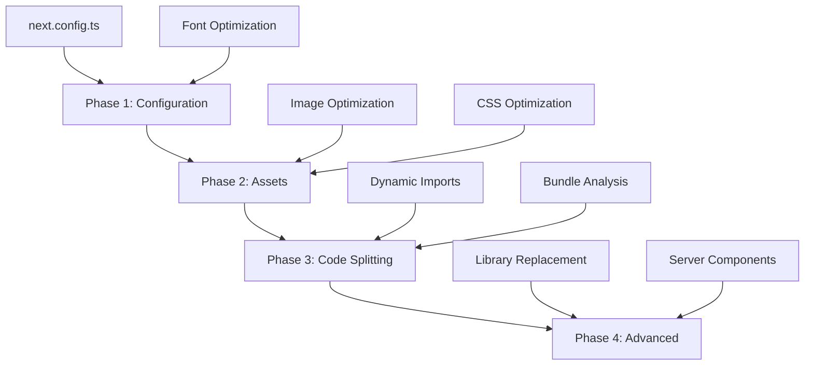

# Design Document: Next.js Performance Optimization

## Overview

Данный документ описывает архитектурный подход к оптимизации производительности Next.js приложения для достижения Lighthouse Performance Score 100/100. Оптимизация будет проводиться поэтапно, начиная с низкорискованных изменений конфигурации и заканчивая более сложными архитектурными улучшениями.

### Current State Analysis

**Performance Scores:**
- Home: 60/100 (LCP: 4.63s, TBT: 50ms)
- About: 77/100 (LCP: 6.26s, TBT: 58ms)
- Blog: 71/100
- Projects: 73/100
- Media: 72/100
- Contact: 76/100

**Key Issues Identified:**
1. LCP > 2.5s на всех страницах (критично)
2. Неоптимизированная загрузка шрифтов (Google Fonts через CDN)
3. Тяжелые зависимости (FullCalendar, ApexCharts, react-slick, etc.)
4. Отсутствие lazy loading для компонентов ниже fold
5. Неоптимальная конфигурация Next.js
6. Избыточный JavaScript bundle

### Target Metrics

- **Performance Score**: 100/100
- **LCP**: < 2.5s
- **TBT**: < 200ms
- **CLS**: < 0.1
- **Bundle Size Reduction**: минимум 30%

## Architecture

### Optimization Strategy

Оптимизация будет проводиться в 4 фазы с возрастающим уровнем риска:



### Phase 1: Low-Risk Configuration (Безопасно)

Изменения в конфигурации без модификации кода компонентов.

### Phase 2: Asset Optimization (Низкий риск)

Оптимизация изображений, шрифтов и CSS без изменения логики.

### Phase 3: Code Splitting (Средний риск)

Внедрение lazy loading и динамических импортов.

### Phase 4: Advanced Optimization (Высокий риск)

Замена библиотек и архитектурные изменения.

## Components and Interfaces

### 1. Next.js Configuration Layer

**File:** `frontend_next/next.config.ts`

**Current Issues:**
- `experimental.optimizeCss` уже включен ✓
- `compiler.removeConsole` настроен ✓
- Image optimization настроен ✓
- Но отсутствуют некоторые оптимизации

**Optimizations:**

```typescript
// Добавить в next.config.ts
const nextConfig: NextConfig = {
  // ... existing config
  
  // Compiler optimizations
  compiler: {
    removeConsole: process.env.NODE_ENV === 'production' ? {
      exclude: ['error', 'warn']
    } : false,
    // Добавить:
    reactRemoveProperties: process.env.NODE_ENV === 'production' ? {
      properties: ['^data-test']
    } : false,
  },
  
  // Улучшить webpack config
  webpack: (config, { dev, isServer }) => {
    // Оптимизация для production
    if (!dev && !isServer) {
      config.optimization = {
        ...config.optimization,
        moduleIds: 'deterministic',
        runtimeChunk: 'single',
        splitChunks: {
          chunks: 'all',
          cacheGroups: {
            // Тяжелые библиотеки в отдельные chunks
            fullcalendar: {
              test: /[\\/]node_modules[\\/]@fullcalendar[\\/]/,
              name: 'fullcalendar',
              priority: 20,
            },
            apexcharts: {
              test: /[\\/]node_modules[\\/](apexcharts|react-apexcharts)[\\/]/,
              name: 'apexcharts',
              priority: 20,
            },
            carousel: {
              test: /[\\/]node_modules[\\/](react-slick|slick-carousel|swiper)[\\/]/,
              name: 'carousel',
              priority: 20,
            },
            radix: {
              test: /[\\/]node_modules[\\/]@radix-ui[\\/]/,
              name: 'radix-ui',
              priority: 15,
            },
            vendor: {
              test: /[\\/]node_modules[\\/]/,
              name: 'vendor',
              priority: 10,
            },
          }
        }
      };
    }
    return config;
  },
  
  // Добавить compression
  compress: true,
  
  // Оптимизировать poweredByHeader
  poweredByHeader: false,
  
  // Добавить swcMinify (если еще не включен)
  swcMinify: true,
};
```

### 2. Font Optimization Layer

**Current Issues:**
- Шрифты загружаются через Google Fonts CDN (блокирующий запрос)
- Cabin и Geometria загружаются через `<link>` в `<head>`
- Inter загружается через next/font ✓

**Solution:**

```typescript
// frontend_next/src/app/layout.tsx
import { Inter, Cabin } from 'next/font/google';
import localFont from 'next/font/local';

// Inter (уже есть) ✓
const inter = Inter({
  subsets: ['latin', 'cyrillic'],
  variable: '--font-inter',
  display: 'swap',
  preload: true,
});

// Cabin через next/font
const cabin = Cabin({
  subsets: ['latin', 'cyrillic'],
  weight: ['400', '500', '600', '700'],
  style: ['normal', 'italic'],
  variable: '--font-cabin',
  display: 'swap',
  preload: true,
});

// Geometria как local font (если есть файлы)
const geometria = localFont({
  src: [
    {
      path: '../fonts/geometria-regular.woff2',
      weight: '400',
      style: 'normal',
    },
    {
      path: '../fonts/geometria-bold.woff2',
      weight: '700',
      style: 'normal',
    },
  ],
  variable: '--font-geometria',
  display: 'swap',
  preload: true,
});

// Удалить <link> теги из <head>
// Применить переменные в body
<body className={`${inter.variable} ${cabin.variable} ${geometria.variable}`}>
```

**Impact:**
- Устранение блокирующих запросов к Google Fonts CDN
- Автоматическая оптимизация и preload
- Уменьшение FOIT (Flash of Invisible Text)

### 3. Image Optimization Layer

**Current State:**
- Компоненты уже используют next/image ✓
- HeroVideoSection использует Image с priority ✓
- MainContentSection использует Image для логотипов ✓

**Optimizations Needed:**

```typescript
// Паттерн для критичных изображений (LCP)
<Image
  src="/hero-image.jpg"
  alt="Hero"
  width={1920}
  height={1080}
  priority // Для LCP элементов
  quality={90} // Баланс качества/размера
  placeholder="blur"
  blurDataURL="data:image/jpeg;base64,..." // Генерировать
/>

// Паттерн для изображений ниже fold
<Image
  src="/content-image.jpg"
  alt="Content"
  width={800}
  height={600}
  loading="lazy" // Ленивая загрузка
  quality={85}
  sizes="(max-width: 768px) 100vw, (max-width: 1200px) 50vw, 33vw"
/>

// Паттерн для фоновых изображений
<Image
  src="/background.jpg"
  alt=""
  fill
  style={{ objectFit: 'cover' }}
  quality={80}
  priority={false}
/>
```

**Actions:**
1. Audit всех Image компонентов
2. Добавить priority для LCP изображений
3. Добавить placeholder="blur" где возможно
4. Оптимизировать sizes attribute
5. Проверить, что все изображения имеют width/height

### 4. Code Splitting and Lazy Loading Layer

**Strategy:**

```typescript
// Паттерн 1: Динамический импорт для тяжелых компонентов
const HeavyComponent = dynamic(() => import('@/components/HeavyComponent'), {
  loading: () => <Skeleton />,
  ssr: false, // Если компонент не критичен для SEO
});

// Паттерн 2: Динамический импорт с named export
const AdminPanel = dynamic(
  () => import('@/components/admin/AdminPanel').then(mod => mod.AdminPanel),
  { ssr: false }
);

// Паттерн 3: Условный импорт
const ChartComponent = dynamic(
  () => import('react-apexcharts'),
  { ssr: false, loading: () => <div>Loading chart...</div> }
);
```

**Components to Lazy Load:**

1. **Admin Components** (не нужны на публичных страницах):
   - Все компоненты в `src/components/admin/*`
   - FullCalendar
   - ApexCharts

2. **Below-the-fold Components**:
   - TestimonialCarousel
   - ServicesSectionMobile
   - Footer components (можно загружать при скролле)

3. **Heavy Libraries**:
   - react-slick / swiper (карусели)
   - react-modal-image (lightbox)
   - react-apexcharts (графики)

**Implementation:**

```typescript
// frontend_next/src/app/page.tsx
import dynamic from 'next/dynamic';

// Критичные компоненты - обычный импорт
import Header_mini from "@/components/Header_mini";
import Header_mobile from "@/components/Header_mobile";

// Некритичные компоненты - динамический импорт
const Footer = dynamic(() => import('@/components/Footer'), {
  loading: () => <div className="h-64 bg-[#0E1011]" />,
});

const FooterMobile = dynamic(() => import('@/components/Footer_mobile'), {
  loading: () => <div className="h-64 bg-[#0E1011]" />,
});

// HomeContentWrapper уже использует dynamic ✓
```

### 5. CSS Optimization Layer

**Current State:**
- Tailwind CSS используется
- Multiple CSS files в src/styles/
- experimental.optimizeCss включен ✓

**Optimizations:**

```javascript
// tailwind.config.js
module.exports = {
  content: [
    './src/**/*.{js,ts,jsx,tsx,mdx}',
  ],
  // Добавить purge для production
  safelist: [
    // Классы, которые генерируются динамически
  ],
  theme: {
    extend: {
      // Минимизировать кастомные утилиты
    },
  },
  // Оптимизация для production
  ...(process.env.NODE_ENV === 'production' && {
    cssnano: {
      preset: ['default', {
        discardComments: { removeAll: true },
      }],
    },
  }),
};
```

**Actions:**
1. Audit неиспользуемых CSS файлов в src/styles/
2. Consolidate compatibility CSS files
3. Ensure Tailwind purge работает корректно
4. Минимизировать custom CSS

### 6. Bundle Analysis and Optimization Layer

**Tools:**

```bash
# Установить bundle analyzer (уже есть в devDependencies ✓)
npm install --save-dev @next/bundle-analyzer

# Добавить в package.json
"scripts": {
  "analyze": "ANALYZE=true npm run build"
}
```

**Configuration:**

```javascript
// next.config.ts
const withBundleAnalyzer = require('@next/bundle-analyzer')({
  enabled: process.env.ANALYZE === 'true',
});

module.exports = withBundleAnalyzer(nextConfig);
```

**Heavy Dependencies to Review:**

```json
// package.json - тяжелые зависимости
{
  "@fullcalendar/*": "~500KB", // Используется только в admin
  "apexcharts": "~400KB", // Используется только в admin
  "react-apexcharts": "~50KB",
  "react-slick": "~100KB", // Можно заменить на swiper
  "slick-carousel": "~150KB",
  "swiper": "~200KB", // Уже есть, использовать вместо slick
  "react-modal-image": "~50KB", // Можно заменить на легковесную альтернативу
  "simple-react-lightbox": "~100KB",
  "react-responsive-carousel": "~80KB",
}
```

**Optimization Strategy:**
1. Lazy load admin-only libraries
2. Replace react-slick with swiper (уже есть)
3. Consider lightweight lightbox alternative
4. Remove unused carousel libraries

### 7. API and Data Fetching Layer

**Current Patterns:**

```typescript
// Текущий паттерн (CSR)
'use client';
const [data, setData] = useState([]);
useEffect(() => {
  fetch('/api/data').then(res => setData(res));
}, []);
```

**Optimized Patterns:**

```typescript
// Паттерн 1: Server Component (SSR)
// app/page.tsx
async function getData() {
  const res = await fetch('http://localhost:8000/api/data', {
    cache: 'force-cache', // или 'no-store' для динамических данных
  });
  return res.json();
}

export default async function Page() {
  const data = await getData();
  return <div>{/* render data */}</div>;
}

// Паттерн 2: ISR (Incremental Static Regeneration)
async function getData() {
  const res = await fetch('http://localhost:8000/api/data', {
    next: { revalidate: 3600 } // Revalidate каждый час
  });
  return res.json();
}

// Паттерн 3: Client-side с кешированием
import useSWR from 'swr';
const { data } = useSWR('/api/data', fetcher, {
  revalidateOnFocus: false,
  dedupingInterval: 60000,
});
```

**Implementation Strategy:**
1. Identify static vs dynamic data
2. Convert static pages to SSG/ISR
3. Keep dynamic interactions as CSR with caching
4. Use React Server Components where possible

## Data Models

### Performance Metrics Model

```typescript
interface PerformanceMetrics {
  page: string;
  score: number; // 0-100
  metrics: {
    fcp: number; // First Contentful Paint (ms)
    lcp: number; // Largest Contentful Paint (ms)
    tbt: number; // Total Blocking Time (ms)
    cls: number; // Cumulative Layout Shift
    si: number;  // Speed Index (ms)
  };
  timestamp: Date;
}

interface OptimizationResult {
  before: PerformanceMetrics;
  after: PerformanceMetrics;
  improvement: {
    score: number; // percentage
    lcp: number;   // ms saved
    tbt: number;   // ms saved
  };
  changes: string[];
}
```

### Bundle Analysis Model

```typescript
interface BundleAnalysis {
  totalSize: number; // bytes
  chunks: {
    name: string;
    size: number;
    modules: string[];
  }[];
  heavyDependencies: {
    name: string;
    size: number;
    usedIn: string[];
  }[];
}
```

## Error Handling

### Rollback Strategy

```typescript
// Сохранение оригинального кода в комментариях
/* ORIGINAL CODE - ROLLBACK IF NEEDED
const HeavyComponent = () => {
  // ... original implementation
};
*/

// NEW OPTIMIZED CODE
const HeavyComponent = dynamic(() => import('./HeavyComponent'), {
  loading: () => <Skeleton />,
});
```

### Testing After Each Change

```bash
# После каждой оптимизации
npm run dev
# Проверить функционал вручную

# Запустить Lighthouse
npx unlighthouse --site http://localhost:3000 --desktop

# Сравнить метрики
```

### Error Recovery

```typescript
// Паттерн для безопасного dynamic import
const SafeComponent = dynamic(
  () => import('./Component').catch(err => {
    console.error('Failed to load component:', err);
    return { default: () => <FallbackComponent /> };
  }),
  { ssr: false }
);
```

## Testing Strategy

### Phase-by-Phase Testing

**After Each Phase:**

1. **Functional Testing**
   - Проверить все страницы вручную
   - Проверить критичные user flows
   - Проверить responsive design

2. **Performance Testing**
   ```bash
   npx unlighthouse --site http://localhost:3000 --desktop --outputPath ./lighthouse-reports/phase-{N}
   ```

3. **Bundle Size Testing**
   ```bash
   npm run analyze
   # Сравнить размеры chunks
   ```

4. **Regression Testing**
   - Проверить, что существующий функционал работает
   - Проверить console на ошибки
   - Проверить network tab на failed requests

### Automated Testing

```typescript
// vitest для unit tests (уже настроен ✓)
// playwright для e2e tests (уже настроен ✓)

// Добавить performance tests
// tests/e2e/performance.spec.ts
test('Home page loads within 3 seconds', async ({ page }) => {
  const start = Date.now();
  await page.goto('http://localhost:3000');
  await page.waitForLoadState('networkidle');
  const loadTime = Date.now() - start;
  expect(loadTime).toBeLessThan(3000);
});
```

### Success Criteria Validation

```typescript
interface ValidationResult {
  passed: boolean;
  metrics: {
    performanceScore: number; // Must be 100
    lcp: number; // Must be < 2500ms
    tbt: number; // Must be < 200ms
    cls: number; // Must be < 0.1
    bundleReduction: number; // Must be >= 30%
  };
  failures: string[];
}
```

## Implementation Phases

### Phase 1: Configuration Optimization (Day 1)

**Risk Level:** ✅ Low

**Changes:**
1. Update next.config.ts
   - Add reactRemoveProperties
   - Optimize webpack splitChunks
   - Add compression
   - Remove poweredByHeader

2. Font Optimization
   - Convert Cabin to next/font
   - Setup Geometria as local font
   - Remove CDN links from layout

3. Update Tailwind config
   - Ensure purge is optimized
   - Add cssnano for production

**Expected Impact:**
- Performance Score: +5-10 points
- LCP: -200-500ms
- Bundle Size: -10-15%

**Testing:**
- Run dev server
- Check all pages render correctly
- Run Lighthouse audit
- Compare metrics

### Phase 2: Asset Optimization (Day 2)

**Risk Level:** ✅ Low-Medium

**Changes:**
1. Image Optimization
   - Audit all Image components
   - Add priority to LCP images
   - Add placeholder="blur"
   - Optimize sizes attribute

2. CSS Optimization
   - Remove unused CSS files
   - Consolidate compatibility styles
   - Ensure Tailwind purge works

**Expected Impact:**
- Performance Score: +5-10 points
- LCP: -500-1000ms
- CLS: Improved

**Testing:**
- Visual regression testing
- Check image loading
- Verify no layout shifts

### Phase 3: Code Splitting (Day 3-4)

**Risk Level:** ⚠️ Medium

**Changes:**
1. Lazy Load Components
   - Footer components
   - Admin components
   - Heavy libraries (charts, calendars)

2. Bundle Analysis
   - Run bundle analyzer
   - Identify heavy dependencies
   - Create optimization plan

3. Dynamic Imports
   - Convert heavy components to dynamic
   - Add loading states
   - Test error boundaries

**Expected Impact:**
- Performance Score: +10-15 points
- TBT: -20-40ms
- Bundle Size: -20-30%

**Testing:**
- Test all dynamic components load
- Check loading states
- Verify error handling

### Phase 4: Advanced Optimization (Day 5-6)

**Risk Level:** ⚠️ High

**Changes:**
1. Library Replacement
   - Replace react-slick with swiper
   - Consider lightweight lightbox
   - Remove unused carousel libraries

2. Data Fetching Optimization
   - Convert static pages to SSG/ISR
   - Add caching strategies
   - Implement Server Components where possible

3. Final Optimizations
   - Preload critical resources
   - Add resource hints
   - Optimize prefetching

**Expected Impact:**
- Performance Score: +5-10 points (reach 100)
- LCP: Final optimization to < 2.5s
- Bundle Size: Final 30%+ reduction

**Testing:**
- Full regression testing
- Performance validation
- User acceptance testing

## Monitoring and Validation

### Continuous Monitoring

```bash
# Script для автоматического мониторинга
# scripts/performance-monitor.sh
#!/bin/bash

echo "Running Lighthouse audit..."
npx unlighthouse --site http://localhost:3000 --desktop --outputPath ./lighthouse-reports/$(date +%Y%m%d-%H%M%S)

echo "Analyzing bundle..."
ANALYZE=true npm run build

echo "Generating report..."
node scripts/generate-performance-report.js
```

### Performance Dashboard

```typescript
// scripts/generate-performance-report.js
const fs = require('fs');
const path = require('path');

function generateReport() {
  const reports = fs.readdirSync('./lighthouse-reports');
  const latestReport = reports[reports.length - 1];
  
  // Parse lighthouse JSON
  // Generate comparison report
  // Output to console and file
}
```

### Success Metrics

```typescript
const SUCCESS_CRITERIA = {
  performanceScore: 100,
  lcp: 2500, // ms
  fid: 100,  // ms
  cls: 0.1,
  tbt: 200,  // ms
  bundleReduction: 30, // %
};

function validateSuccess(metrics: PerformanceMetrics): boolean {
  return (
    metrics.score >= SUCCESS_CRITERIA.performanceScore &&
    metrics.metrics.lcp <= SUCCESS_CRITERIA.lcp &&
    metrics.metrics.cls <= SUCCESS_CRITERIA.cls &&
    metrics.metrics.tbt <= SUCCESS_CRITERIA.tbt
  );
}
```

## Risk Mitigation

### Backup Strategy

1. **Git Branches**
   ```bash
   git checkout -b optimization/phase-1
   # Make changes
   git commit -m "Phase 1: Configuration optimization"
   # Test
   # If successful, merge to main
   # If failed, abandon branch
   ```

2. **Code Comments**
   - Сохранять оригинальный код в комментариях
   - Документировать причины изменений
   - Добавлять rollback инструкции

3. **Incremental Deployment**
   - Тестировать каждую фазу отдельно
   - Не переходить к следующей фазе без подтверждения
   - Откатывать при обнаружении проблем

### Rollback Procedures

```typescript
// Если оптимизация вызывает проблемы:

// 1. Откатить изменения
git revert <commit-hash>

// 2. Восстановить из комментариев
// Раскомментировать ORIGINAL CODE
// Закомментировать NEW CODE

// 3. Документировать проблему
// Добавить в issues.md:
// - Что пошло не так
// - Какие метрики ухудшились
// - Альтернативные подходы
```

## Conclusion

Данный design предоставляет структурированный подход к оптимизации производительности с минимизацией рисков. Поэтапная реализация позволяет контролировать прогресс и быстро откатывать проблемные изменения.

**Key Success Factors:**
1. Методичный подход (одна оптимизация за раз)
2. Тщательное тестирование после каждого изменения
3. Документирование всех изменений
4. Готовность к откату при проблемах
5. Фокус на метриках и измеримых результатах
